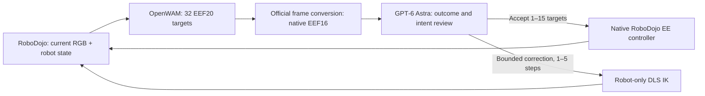

# OpenWAM with GPT‑6 Policy

GPT‑6 Astra reviews proposals from **OpenWAM‑Alpha‑Sim‑RoboDojo** and selects native robot actions in **RoboDojo / Isaac Sim 5.1**. This repository adapts the [GPT-as-Policy](https://github.com/anonymous-report-421/GPT-as-Policy) experiment to the released [OpenWAM](https://github.com/OpenWAM-Official/OpenWAM) world–action model.

**Research integration for simulation.** It does not run a physical robot, train a model, or establish a leaderboard score. See [validation](docs/validation.md) for the exact checks performed.

**Verified deployment:** isolated policy environment, two real GPU proposals, and a real Astra + RoboDojo smoke with 2 decisions / 30 controls. Whole-GPU sampled peak: **32.93 GiB** on the user’s expanded-memory 4090. The smoke stopped at its decision budget; it is not a task-success result.

## Control loop



The OpenWAM input uses the original instruction, three original RGB arrays, measured link6 poses, and native gripper commands. Its official preprocessing, normalization statistics, 80D unified representation and EEF20 decoding are retained. The host converts arm-base poses to environment-origin coordinates with OpenWAM's canonical helpers. The simulator's measured base transforms must match that calibration within 0.1 mm / 0.001 rad. The angular tolerance covers the measured 0.000302 rad rounding of the published `.707` root quaternion in Isaac; neither the canonical conversion nor the physical configuration is changed. Per-run deviations are recorded.

Astra sees all **32** target poses and current observations. It can accept the first **1–15** targets or, following the original outcome/intent gate, issue **1–5** bounded corrections. Unexecuted targets are discarded before a fresh proposal. There is no speculative physics, rollback, hidden object-state planner, or automatic retry of a mutating request.

### Experimental comparability

Preserved: `gpt-6-astra`, `xhigh`, 480 px Astra image previews, original task instruction, outcome/intent gate and correction validation, 5 cm / 0.35 rad correction limits, 25 Hz native control observations, native task success/timeout checks, all recorded control observations, frozen task/layout assets, and per-profile Codex leases.

Changed explicitly: π0.5 → OpenWAM; H50 joint14 → H32 EEF20, converted to native EEF16; student commands use RoboDojo's native EE/IK controller; the proposal description names target poses rather than joint FK. Proprioception and Astra's bounded DLS correction commands remain joint14. The panel records OpenWAM generation seed **42**, so its identity differs from the π0.5 panel while scene/layout hashes remain comparable. This is a new policy experiment, not a numerically equivalent replacement.

The gate implementation is byte-identical to the pinned baseline. Its inherited wording mentions “robot-only FK”; the accompanying embodiment context explicitly explains that OpenWAM supplies native EEF targets and that target arrival is not guaranteed. Current robot FK is still independently checked.

The default **100-decision budget** is recorded. A run hitting it before native termination is `budget_censored`, excluded from native success-rate denominators. A two-decision smoke test is not a benchmark result.

## Pinned dependencies

Exact Git and checkpoint revisions are in [configs/pins.json](configs/pins.json). Generated upstream code lives under ignored `.deps/` and `.runtime/`; the integration is a reviewable [patch](patches/openwam-runtime.patch) plus the small `astra_openwam` package. Each run snapshots both with hashes.

The policy uses Python 3.11, PyTorch 2.7.1 / CUDA 12.8 and the [released RoboDojo checkpoint](https://huggingface.co/OpenWAM/OpenWAM-Alpha-Sim-RoboDojo), whose weight file is about **24.8 GB**. It runs 10 synchronous denoising steps, with compilation, DiT cache and decoded video disabled. Latent world/action generation remains enabled. The repository does not contain model weights or credentials.

The simulator stays in its existing Isaac environment. Do not install OpenWAM into that environment. The deployment scripts reuse a prepared Linux NVIDIA/Docker RoboDojo image, its assets and Codex 0.153.4 installation; they are not a bare-server Isaac installer.

## Setup on the evaluation server

```bash
git clone https://github.com/chengqingzeng/OpenWAM-with-GPT6-Policy.git
cd OpenWAM-with-GPT6-Policy
export OPENWAM_RUNTIME=/absolute/path/openwam-gpt6-runtime
export ROBODOJO_BASE=/absolute/path/robodojo-repro
bash scripts/setup_server.sh --python /absolute/path/python3.11 \
  --runtime "$OPENWAM_RUNTIME"
```

This creates `.venv`, fetches exact source revisions, installs the policy dependencies, records `policy-environment.freeze.txt`, and downloads/hash-verifies the checkpoint. HTTP(S) proxy settings are inherited. The optional `--wait-for /path/to/measurement/state.json` defers installation until an existing measurement exits its `running` state. If the host lacks `nvcc`, installation reuses the existing CUDA 12.8 container for DeepSpeed metadata/build checks while writing only the isolated policy venv. No training extensions are built (`DS_BUILD_OPS=0`). A host-compatible `cryptography` wheel is selected after the container installation, since the container has newer glibc than Ubuntu 20.04. `requirements-policy.lock.txt` pins the tested dependency versions. Installation does not launch inference or claim GPU capacity.

For CPU checks alone:

```bash
python3 scripts/bootstrap_sources.py
python3 -m venv .venv
.venv/bin/pip install -e '.[dev]'
.venv/bin/python -m pytest -q
```

`configs/experiment.yaml` documents the fixed experiment contract; the launch scripts enforce those defaults. It is not a general-purpose configuration loader. Runtime overrides and source hashes are recorded in each archive.

## Run one frozen case

A compatible pre-existing deployment supplies the image `robodojo-repro-runtime:ee67a14`, `cache/robodojo-data/Assets`, `src/RoboDojo/.git`, `deployment/seccomp-codex.json`, `tools/codex-0.153.4`, and previously authenticated `private/auth_profiles`. The runtime mounts that profile directory directly so its exclusive locks remain shared with other experiments. Credentials are never copied into this repository or artifacts. Choose an idle independently authenticated profile; two profiles still share account limits.

```bash
export ROBODOJO_BASE=/absolute/path/robodojo-repro
export OPENWAM_RUNTIME=/absolute/path/openwam-gpt6-runtime
export ROLLOUT_AUTH_PROFILE=codex_a_2
# If the venv uses uv-managed Python, mount its installation at the same path:
export UV_PYTHON_ROOT=/absolute/path/.local/share/uv/python

bash scripts/container.sh bash "$PWD/scripts/run_case.sh" \
  openwam_smoke_001 build_tower__standard__g0__l0 2
```

The final argument is the decision budget. Use **100** for the documented reference setting. Use a fresh experiment ID and an unused case for benchmark work; the upstream ledger rejects duplicate reservations. The native 60-case panel is frozen from the supplied assets and verified before execution. This command runs one selected case, not the full panel.

The container uses host networking for loopback RPC, GPU 0 for both processes, policy port **18850**, simulator port **19513**, and `/mnt/rollout/robodojo_mixed_control` for writable output. This preserves the baseline managed-profile trust-path contract inside this container; the bind mount still points exclusively to the new `$OPENWAM_RUNTIME` host directory. It renders the native `curobo_tmp.yml` path placeholders in an isolated X5 asset copy and reuses Isaac extension caches in an isolated writable container home. Robot/control parameters are unchanged. Its assets and existing deployment mount are read-only; only the shared managed-auth directory is writable for its normal login refresh and lease. It never stops unrelated jobs.

## Evidence and outputs

Archives under `$OPENWAM_RUNTIME/results/` include source and launch manifests, checkpoint identity, frozen case, original observation NPZs, original EEF20 and converted EEF16 proposals, Astra assessments, executed commands with measured joint14 states, native outcome and videos. Sensor recording uses lossless ZIP level 1; no observation is dropped or resized before policy input. Audit-video rendering occurs during finalization.

An offline policy check accepts a native `sim/<episode-id>/observations/*.npz` recording, including its instruction:

```bash
.venv/bin/python scripts/smoke_policy.py \
  --checkpoint "$OPENWAM_RUNTIME/checkpoints/OpenWAM-Alpha-Sim-RoboDojo" \
  --observation /absolute/path/recorded-observation.npz \
  --output "$OPENWAM_RUNTIME/offline-smoke-001"
```

It verifies the physical-coordinate round trip, generates two proposals, and records latency and PyTorch GPU-memory peaks. It does not call Astra or step the simulator. Test simultaneous policy+simulator memory before scheduling multiple episodes. Full training requirements from upstream do not describe this inference-only setup.

## Attribution

This integration is MIT licensed. The baseline's MIT notice and OpenWAM's Apache-2.0 license are retained in [licenses/](licenses/). See [THIRD_PARTY_NOTICES.md](THIRD_PARTY_NOTICES.md). This is an independent integration; it is not an official OpenAI, OpenWAM or RoboDojo release.
